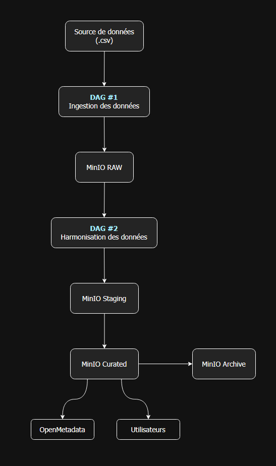

## Architecture retenue

L'architecture du Data Lake repose sur quatre zones principales :

```text
RAW → STAGING → CURATED → ARCHIVE
```

<br>

## Couche RAW

### Objectif

Les fichiers y sont déposés sans aucune modification afin de conserver une copie fidèle des données d'origine.

### Contenu

Exemple de structure :

```text
raw/
└── production_lines/
    ├── lineA/
    ├── lineB/
    ├── lineC/
    ├── lineD/
    └── lineE/
```

Puis, lors de l'automatisation :

```text
raw/
└── production_lines/
    └── lineA/
        └── year=2025/
            └── month=05/
                └── LineA_Stable_10K.csv
```

<br>

## Couche STAGING

### Objectif

La couche STAGING permet de standardiser et préparer les données pour les traitements analytiques.

### Transformations réalisées

Les opérations prévues sont :

* conversion des noms de colonnes en minuscules
* harmonisation des noms de colonnes
* ajout de colonnes manquantes avec valeur nulle
* conversion des horodatages au format datetime

### Schéma cible

Toutes les lignes de production seront harmonisées vers le schéma suivant :

| Colonne      | Type     |
| ------------ | -------- |
| timestamp    | datetime |
| temperature  | float    |
| pressure     | float    |
| elapsed_time | float    |
| label        | integer  |

### Justification

Cette couche élimine les différences de structure observées entre les fichiers sources et fournit un modèle de données homogène pour les traitements ultérieurs.

<br>

## Couche CURATED

### Objectif

La couche CURATED contient les données validées et prêtes à être consommées.

### Caractéristiques

Les données présentes dans cette couche :

* possèdent un schéma unique
* ont été contrôlées et validées
* sont optimisées pour l'analyse

### Justification

La séparation entre STAGING et CURATED permet d'isoler les opérations techniques de préparation des données des jeux de données destinés aux utilisateurs finaux.

<br>

## Couche ARCHIVE

### Objectif

La couche ARCHIVE permet de gérer le cycle de vie des données conformément aux règles de gouvernance.

### Politique de conservation

Les règles prévues sont :

* archivage automatique après 180 jours
* suppression définitive après 2 ans

### Justification

Cette couche permet :

* de réduire les coûts de stockage
* de respecter les politiques de rétention
* de conserver un historique exploitable en cas d'audit

<br>

## Modélisation Draw.io

